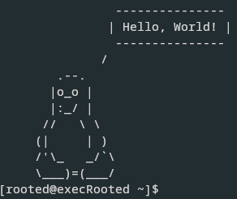

# TuxSay

TuxSay is a fun C# console app that prints an ASCII Tux (Linux penguin) with a customizable message and mood.  

> Made on Arch Linux. You can see compatability down below.





## Features

- Display Tux with different moods (`-1` to `-10`).  
- Print a custom message in a speech bubble.  
- Optionally display Tux without any message (`-n`).  
- Simple command-line flags for help and customization.  

## Installation:

1. Run the installer script on Arch Linux:

```
chmod +x installer.sh
```
```
sudo ./installer.sh
```
*Now the command **tuxsay** will be avalabile system-wide*

---
## Uninstallation:

```
chmod +x uninstaller.sh
```
```
sudo ./uninstaller.sh
```
---
## Compatability:

| Linux Family         | Package Manager | Examples / Notes                                    |
|---------------------|----------------|---------------------------------------------------|
| **Arch-based**       | `pacman`       | Arch Linux, Manjaro, EndeavourOS, ArcoLinux, etc. |
| **Debian-based**     | `apt`          | Debian, Ubuntu, Kali Linux, Linux Mint, Pop!_OS, Elementary OS |
| **Fedora/RHEL-based**| `dnf`          | Fedora, CentOS 8+, Red Hat Enterprise Linux 8+, Rocky Linux, AlmaLinux |
| **openSUSE**         | `zypper`       | openSUSE Leap, openSUSE Tumbleweed, SUSE Linux Enterprise |


---

<h2>Usage</h2>

  tuxsay [flags] [mood] [message]

**Flags:**
  -h, --help      Show this help message
  -n              Print Tux only, without any message

**Moods (-1 to -10):**
  -1  Normal      -2  Angry       -3  Surprised
  -4  Paranoid    -5  Happy       -6  Sleepy
  -7  Crying      -8  Cool        -9  Dead
  -10 Wizard

**Examples:**
  tuxsay -3 "Segmentation fault!"
  tuxsay -7 I deleted my node_modules
  tuxsay -n           # Just shows Tux without any message
  tuxsay -n -5        # Tux happy, no message
  
**Note:** The order of the arguments matter! If you input tuxsay -1 -n Tux will say "-n"

---

**Fell free to modify the code, but give me credit for it.**

---

***Done by execRooted***
